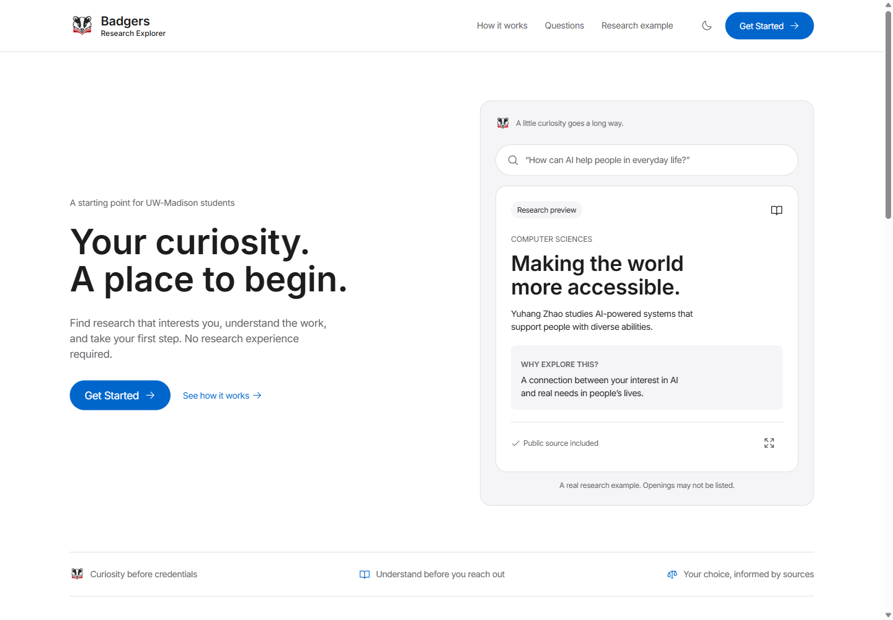
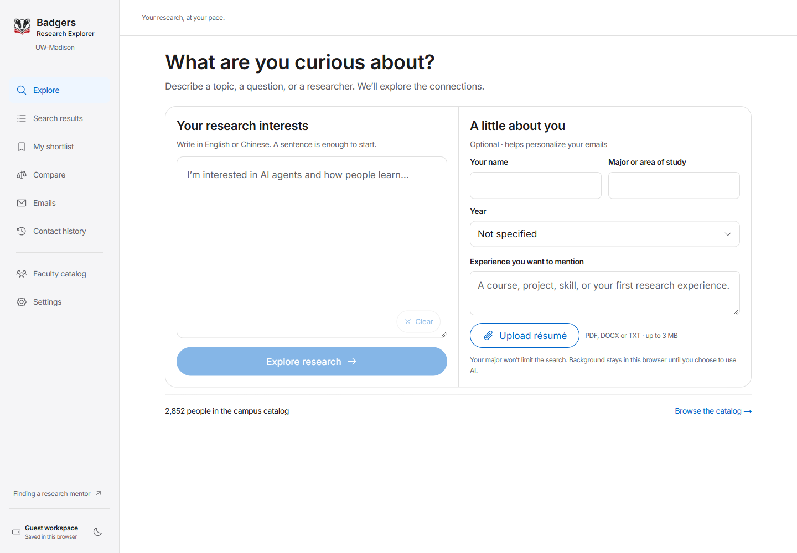

<div align="center">


# Badgers Research Explorer

**Your curiosity. A place to begin.**

Find research at UW–Madison, understand the work, and take your first step.

**English** · [简体中文](README.zh-CN.md)

[Visit the website](https://researchexplorer.online) · [Start exploring](https://researchexplorer.online/explore) · [Run locally](#run-locally) · [Documentation](#documentation)

[](https://researchexplorer.online) [](package.json) [](tsconfig.json)

</div>

<a href="https://researchexplorer.online">
  
</a>

## A starting point for student research

Finding a research mentor often starts with scattered faculty pages, unfamiliar terminology, and uncertainty about what to say. **Badgers Research Explorer** brings discovery, comparison, and individual outreach into one workspace built for UW–Madison students.

Start with a question, a topic, or a researcher's name. You do not need a finished résumé or previous research experience to begin.

## From curiosity to a conversation

| Step           | What you can do                                                                                                                                  |
| -------------- | ------------------------------------------------------------------------------------------------------------------------------------------------ |
| **Explore**    | Describe your interests in English or Chinese. Search the stored faculty catalog, with public-web discovery available to expand the search.      |
| **Understand** | Read accessible research explanations, follow original sources, and see what is supported, missing, or out of date.                              |
| **Compare**    | Save researchers to a shortlist, keep notes, and compare research directions before deciding whom to contact.                                    |
| **Prepare**    | Add optional background or upload a PDF, DOCX, or TXT résumé. Create individual email drafts and review AI revisions before applying them.       |
| **Reach out**  | Verify your UW email, connect the same Outlook mailbox, review each message and its attachments, and track submission status in contact history. |

> **A research connection is not an open position.** Research relevance, public contact information, and evidence of recruiting are checked separately. Missing information stays unknown.

<details>
<summary><strong>Inside the exploration workspace</strong></summary>

<br />


Screenshots captured from the live site on September 27, 2026. Catalog coverage changes over time.

</details>

## Built with

| Layer               | Technology                                                                                                    |
| ------------------- | ------------------------------------------------------------------------------------------------------------- |
| Application         | Next.js App Router · React · TypeScript                                                                       |
| Interface           | CSS design tokens · Radix UI · Phosphor Icons                                                                 |
| AI assistance       | OpenAI for search interpretation, web discovery, research explanations, and writing assistance                |
| Data                | Supabase / PostgreSQL for production state and the shared faculty catalog; SQLite for local application state |
| Email               | Microsoft Entra + Microsoft Graph for connected Outlook sending; Resend for verification codes                |
| Documents           | `pdf-parse` + native canvas for PDFs; Mammoth for DOCX                                                        |
| Deployment & checks | Vercel · Vitest · Playwright                                                                                  |

The browser calls server-side API routes; provider keys stay on the server. The shared catalog contains public professional information. Production application state lives in a separate private database schema.

## Run locally

Use **Node.js 22.13+**; Node.js 24 is recommended.

```bash
git clone https://github.com/Evan0571/BuildFest_project.git
cd BuildFest_project
npm ci
```

Copy [`.env.example`](.env.example) to `.env.local`, then configure the integrations you need:

| Variables                                                               | Purpose                                                                                                                                 |
| ----------------------------------------------------------------------- | --------------------------------------------------------------------------------------------------------------------------------------- |
| `APP_ORIGIN`                                                            | The exact browser origin; use `http://127.0.0.1:3002` for the commands below.                                                           |
| `APP_ENCRYPTION_KEY`                                                    | A 64-character hexadecimal key for encrypted server data. See the generation command in `.env.example`.                                 |
| `OPENAI_API_KEY`, `OPENAI_MODEL`                                        | AI discovery and writing features. Provider usage may incur costs.                                                                      |
| `SUPABASE_URL`, `SUPABASE_SERVICE_ROLE_KEY`                             | Your shared faculty catalog. Apply its [schema migration](supabase/migrations/202609270001_research_catalog.sql) before importing data. |
| `DATABASE_URL`                                                          | PostgreSQL application state for production. Leave unset for local SQLite.                                                              |
| `RESEND_API_KEY`, `VERIFICATION_FROM`                                   | UW email verification through a verified sender domain.                                                                                 |
| `MICROSOFT_CLIENT_ID`, `MICROSOFT_CLIENT_SECRET`, `MICROSOFT_TENANT_ID` | Outlook account authorization and sending. See [Outlook setup](docs/OUTLOOK-SETUP.md).                                                  |

```bash
npm run check:config
npm run dev -- --port 3002
```

Open [http://127.0.0.1:3002](http://127.0.0.1:3002). `check:config` reports configuration presence; it does not validate provider credentials.

A fresh clone does **not** include the production database or a populated faculty catalog. Follow the [catalog guide](docs/CATALOG.md) to configure and populate your own catalog. Unconfigured integrations remain unavailable; failed searches do not silently substitute demo profiles. Keep credentials in `.env.local`, which is excluded from Git.

<details>
<summary><strong>Development checks and production build</strong></summary>

```bash
npm run typecheck
npm test -- --maxWorkers=2
npm run build
npm run start -- --port 3002
```

Stop any development server using the same checkout before building. For cloud hosting, use the [Vercel deployment guide](docs/VERCEL-DEPLOYMENT.md), including PostgreSQL migrations, environment variables, and the Outlook callback URL.

</details>

## Your work, your review

- **Browser workspace:** interests, shortlists, notes, drafts, and attachments are saved in the current browser. They are not automatically synchronized across devices or website origins.
- **Optional résumé:** uploads support text-based PDF, DOCX, and TXT files up to 3 MiB. PDFs are limited to 20 pages; scanned documents need OCR. Extraction does not retain the original uploaded file or automatically attach it to an email.
- **Review before sending:** AI revisions can be previewed, applied, and undone. Outlook sending requires verification and account authorization; the app does not read your inbox. A provider accepting a message is not proof of delivery.
- **Server persistence:** production stores sessions, jobs, and contact history in PostgreSQL, with sensitive message snapshots, attachments, and Outlook tokens encrypted. See [deployment and persistence](docs/VERCEL-DEPLOYMENT.md) for operational details.

## Project map

```text
src/app/                 Pages and server API routes
src/components/explorer/ Discovery, comparison, drafts, and contact history
src/components/ui/       Shared interface components
src/server/              AI, evidence, storage, document parsing, and email
src/lib/                 Shared types, validation, and browser helpers
supabase/migrations/     Catalog and application-state schemas
scripts/                 Configuration checks, imports, and verification
docs/                    Product, deployment, design, and validation notes
```

## Documentation

| Guide                                                           | What it covers                                                       |
| --------------------------------------------------------------- | -------------------------------------------------------------------- |
| [Vercel deployment](docs/VERCEL-DEPLOYMENT.md)                  | Current production setup, storage, environment, and execution limits |
| [Research catalog](docs/CATALOG.md)                             | Public sources, import workflow, and evidence coverage               |
| [Outlook setup](docs/OUTLOOK-SETUP.md)                          | Microsoft app registration, authorization, and sending               |
| [Backend reference](docs/BACKEND.md)                            | API behavior, validation, jobs, and email workflow                   |
| [Verification record](docs/VERIFICATION.md)                     | Dated checks, deployment validation, and known boundaries            |
| [Product requirements](docs/PRD.md) · [Design notes](DESIGN.md) | Product intent and interface decisions                               |

Technical notes include dated development history; the deployment guide describes the current hosting setup.

## Contributors

- [Evan0571](https://github.com/Evan0571)
- [George050121](https://github.com/George050121)
- [Sisyphusheep (@zzhangbrooklyn-art)](https://github.com/zzhangbrooklyn-art)

---

Built for **Badger BuildFest**. An independent student project for UW–Madison, not an official university service. Project mark and design references are documented in [Brand asset](docs/BRAND-ASSET.md) and [Design notes](DESIGN.md).
